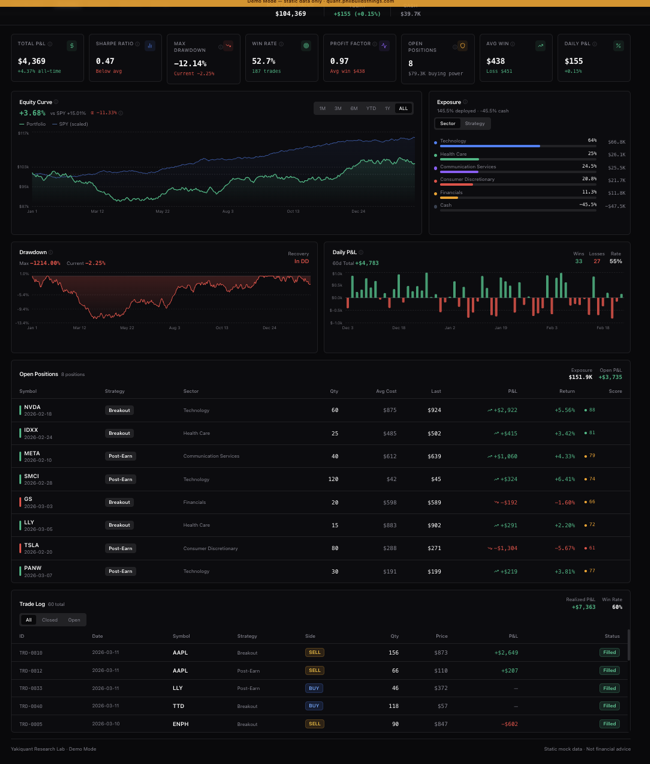

# Yakiquant Demo

**[Live Demo](https://quant.philbuildsthings.com)** · [GitHub](https://github.com/philwilt/yakiquant-demo)

A standalone Next.js dashboard demo for [Yakiquant](https://github.com/philwilt/yakiquant-demo) — an AI-assisted U.S. equities swing trading research lab built in the Yakima Valley.

The full Yakiquant system ingests market data, runs technical scans, generates LLM-powered trade theses via Claude, applies portfolio risk controls, and paper trades via Alpaca. This demo is a portable, public-facing snapshot of that dashboard with mock data — no backend required.



## Features

- **Portfolio Dashboard** — equity curve, drawdown, daily P&L, sector exposure, open positions, and trade log
- **Research Pipeline** — scanner results, AI-generated trade ideas with thesis and adversarial review scores, candidate funnel
- **Watchlist** — price cards with sparklines and a detailed chart/events drawer
- **Settings** — configuration panel
- **Glossary tooltips** — hover definitions for quant/trading terms throughout the UI
- **Mock data by default** — works fully offline; swap in a real API URL to go live

## Stack

| Layer         | Technology              |
| ------------- | ----------------------- |
| Framework     | Next.js 15 (App Router) |
| Language      | TypeScript 5            |
| UI Components | shadcn/ui + Radix UI    |
| Styling       | Tailwind CSS 3          |
| Charts        | Recharts 2              |
| Data Fetching | SWR 2                   |
| Animations    | Framer Motion 11        |

## Getting Started

```bash
npm install
npm run dev
```

Open [http://localhost:3000](http://localhost:3000).

### Connecting to a live API

By default the app uses `lib/mock-data.ts`. To point it at a running Yakiquant API instance, set the base URL in your environment:

```bash
NEXT_PUBLIC_API_URL=http://localhost:8000
```

The hooks in `hooks/` (`useDashboardData`, `useWatchlist`) will pick this up automatically.

## Project Structure

```
app/                  # Next.js App Router pages
  page.tsx            # Portfolio dashboard
  research/           # Research pipeline view
  watchlist/          # Watchlist
  settings/           # Settings
components/
  ui/                 # shadcn/ui primitives
  research/           # Ideas table, scan results, funnel chart
  EquityCurveChart    # Equity curve + benchmark
  DrawdownChart       # Drawdown over time
  DailyPnLChart       # Daily P&L bars
  ExposureChart       # Sector/strategy allocation
  PositionsTable      # Open positions
  TradeLog            # Historical trade log
  WatchlistCard       # Ticker card with sparkline
  MetricsCards        # Sharpe, win rate, and other KPIs
hooks/                # SWR data-fetching hooks
lib/
  types.ts            # Shared TypeScript interfaces
  mock-data.ts        # Offline demo data
  glossary.ts         # Trading term definitions
```

## About Yakiquant

Yakiquant is a personal quant research system for U.S. equities swing trading. The full pipeline:

1. **Ingest** — daily OHLCV bars, news, and earnings calendar via Alpaca + yfinance
2. **Scan** — post-earnings continuation and breakout momentum scanners
3. **Research** — Claude classifies catalysts, generates structured trade theses, and runs adversarial review
4. **Risk** — deterministic hard limits (position size, sector caps, liquidity) + LLM risk gate
5. **Execute** — paper trades submitted to Alpaca
6. **Postmortem** — closed-trade analysis fed back into prompt tuning

See the [full Yakiquant repo](https://github.com/phillipwilt/yakiquant) for the Python backend, FastAPI, PostgreSQL schema, and infrastructure.

## License

MIT
